# Ambient Light / Smart Wake-Up Light

<p align="center">
  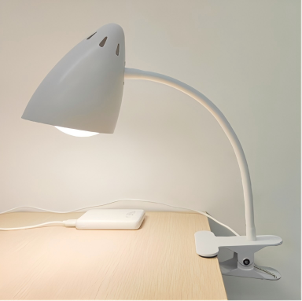
</p>

A silent, light-based wake-up device developed for shared living environments, later evolved into a Bluetooth-controlled hardware product with independent warm- and cool-white LED channels, PWM dimming, scheduled mobile-app control, and multiple hardware revisions.

The project progressed from an everyday dorm-room problem to early circuit prototypes, PCB iterations, full-product assembly, small-batch production, and continuous lifetime testing.

**Project period:** Mar 2022 – Mar 2023  
**Institution:** Jinan University

---

## Origin of the Idea

The project started from a problem I experienced personally in shared student housing: a conventional alarm may wake one person, but it can also disturb everyone else in the room.

A friend first introduced me to research discussing the relationship between light exposure and melatonin regulation. That led us to ask a simple product question:

> **Could we create a quieter and more comfortable way to wake up using light instead of sound?**

From there, we reviewed related research, patents, and existing lighting products, and gradually narrowed the target use case to students and other users living in shared spaces.

The initial concept was therefore not simply “a smart lamp.” It was a **silent wake-up device built around controllable light**, which later evolved into a Bluetooth-connected physical product with warm/cool LED control, scheduling, and multiple hardware revisions.

---

## Highlights

- Approximately **5–6 PCB / hardware iterations**
- Independent warm- and cool-white LED PWM control
- Tuya Bluetooth and mobile-app integration
- Hands-on SMT assembly, hot-air rework, soldering, and board debugging
- **30+ physical units** assembled
- Multi-unit **24/7 lifetime testing**
- Component sourcing, BOM/cost tracking, and assembly planning
- **Silver Award — Jinan University Challenge Cup**

---

## My Contributions

My role grew from hands-on PCB assembly and testing into broader hardware and product-development work.

- Assembled SMT prototypes using a hot plate and performed rework with hot air, tweezers, and a soldering iron.
- Evaluated LED and supporting-component configurations during early prototype development.
- Contributed to later schematic and PCB-layout revisions, especially component and thermal-layout changes.
- Debugged board noise, thermal concentration, Bluetooth RF attenuation, and assembly/serviceability issues.
- Tested Bluetooth connectivity using several smartphones and different Android environments.
- Supported component sourcing, BOM and cost tracking, enclosure selection, assembly planning, and testing.
- Participated in small-batch production and multi-unit lifetime testing.

> **Contribution boundary:** The Bluetooth module and mobile-app platform were based on a Tuya solution. I did not develop the module firmware or mobile application software.

---

## Hardware Overview

One documented constant-current hardware revision used:

| Function | Implementation |
| --- | --- |
| Input power | 5 V DC |
| Logic regulation | `XC6219B332MR`, 3.3 V |
| Wireless control | Tuya `BT7L` Bluetooth module |
| LED drivers | 2 × `OC7140` constant-current LED drivers |
| LEDs | 7 warm-white + 7 cool-white 3030 LEDs |
| Dimming control | Independent `PWM_W` / `PWM_C` |
| Current sensing | 0.05 Ω sense resistor per channel |

```text
                         +--> Warm LED Driver --> Warm LEDs
                         |
5 V Input ---------------+
                         |
                         +--> Cool LED Driver --> Cool LEDs
                         |
                         +--> 3.3 V Regulator --> Bluetooth Module
                                                   |       |
                                                 PWM_W   PWM_C
```

### Schematic

<p align="center">
  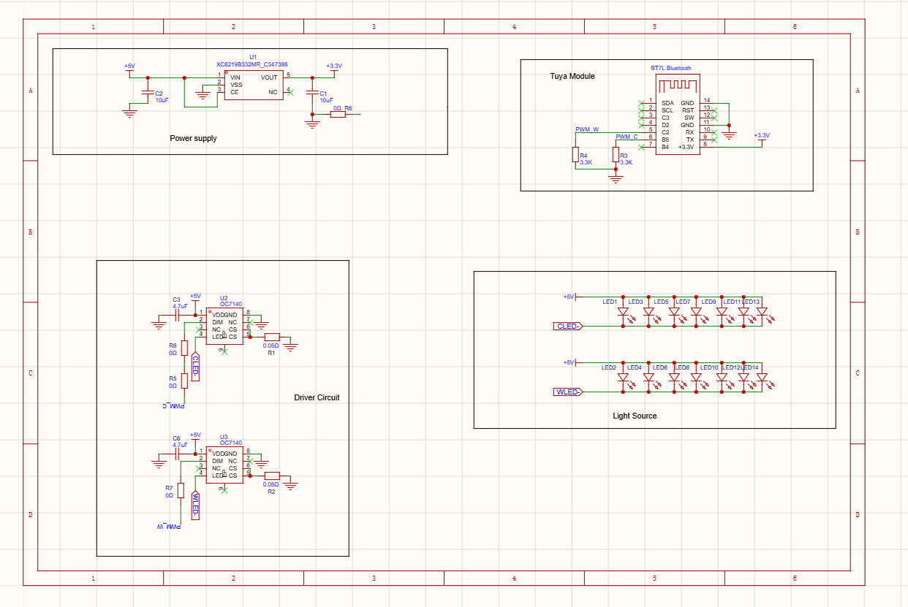
</p>

The schematic shows the power-supply section, Bluetooth module, two independent LED-driver channels, and warm/cool LED arrays.

### PCB Layout

<p align="center">
  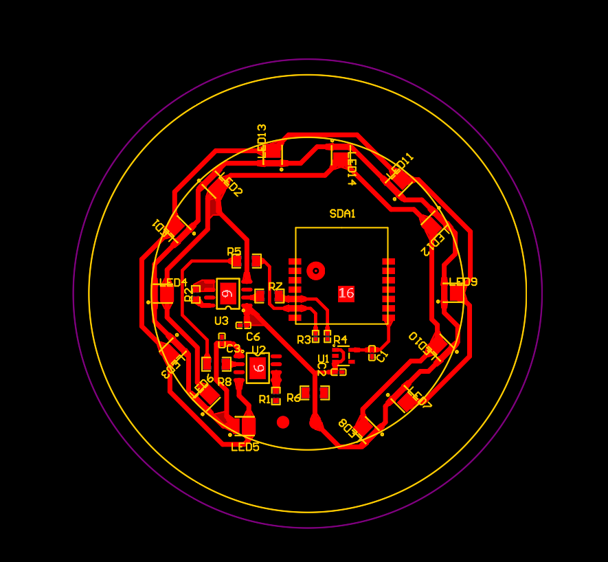
</p>

The schematic and PCB layout above represent the same documented constant-current hardware revision.

---

## Development & Hardware Iteration

The project did not use one fixed circuit throughout development.

Several PCB and hardware implementations were tested as we changed LED selection, drive circuitry, component placement, thermal distribution, and product integration.

### Early Prototype

<p align="center">
  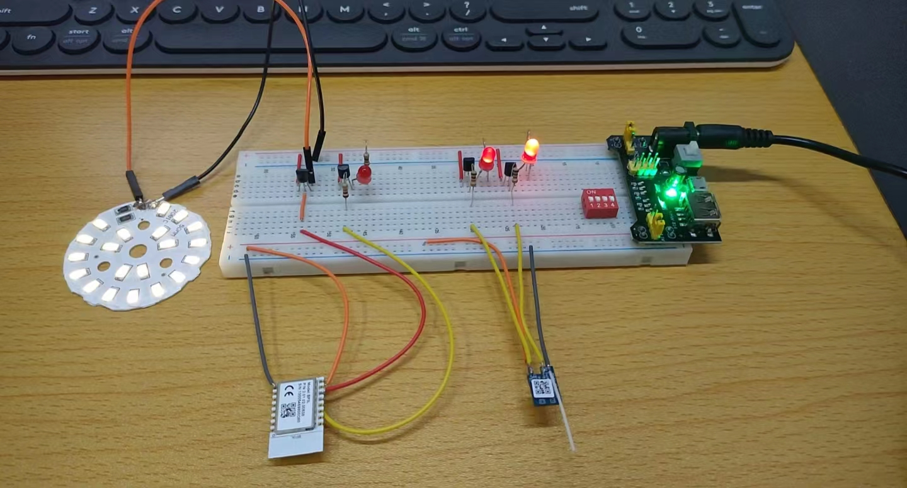
</p>

Early development used discrete development hardware and LED boards to evaluate brightness, component behavior, Bluetooth control, and the basic lighting concept before moving toward more integrated PCB designs.

### PCB Revision

<p align="center">
  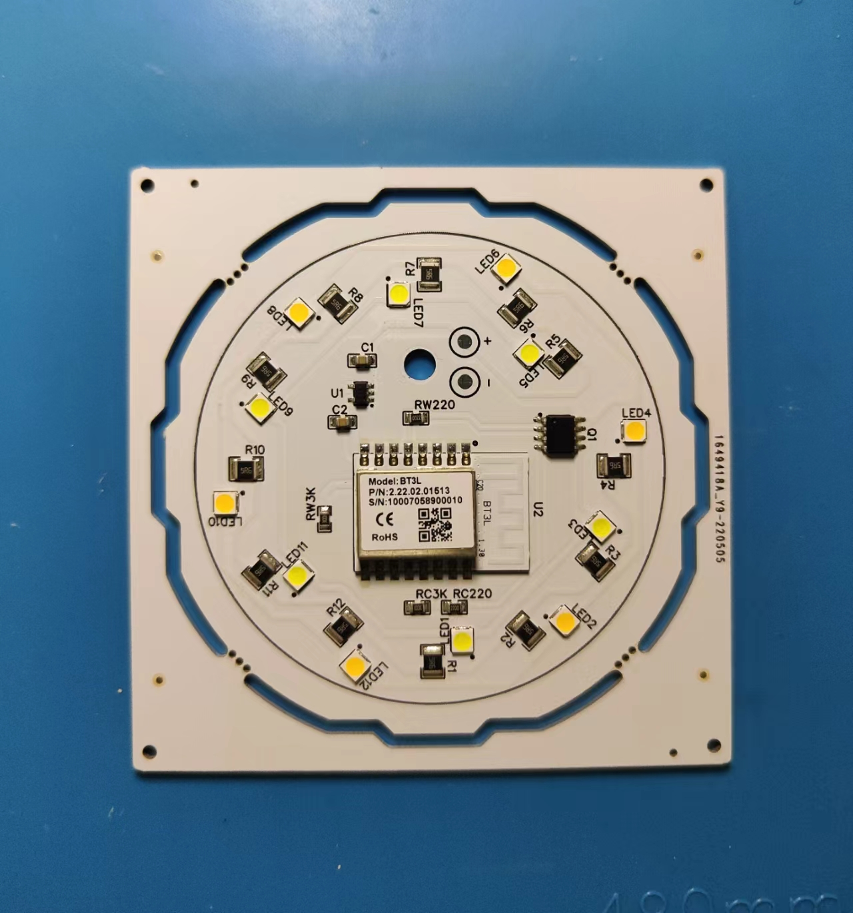
</p>

This is one physical PCB revision from the development process.

It is intentionally shown as a **development revision**, rather than labeled as the final PCB, because several substantially different hardware implementations were created during the project.

The physical PCB shown here is also a different revision from the BT7L / OC7140 constant-current design shown in the Hardware Overview section.

---

## Product Integration

The project extended beyond electronics.

Custom injection-mold tooling was too expensive for the project stage, so we explored commercially available lamp housings, diffusers, flexible arms, clamps, cables, power adapters, and other components that could be combined into a practical product.

### Component Selection

<p align="center">
  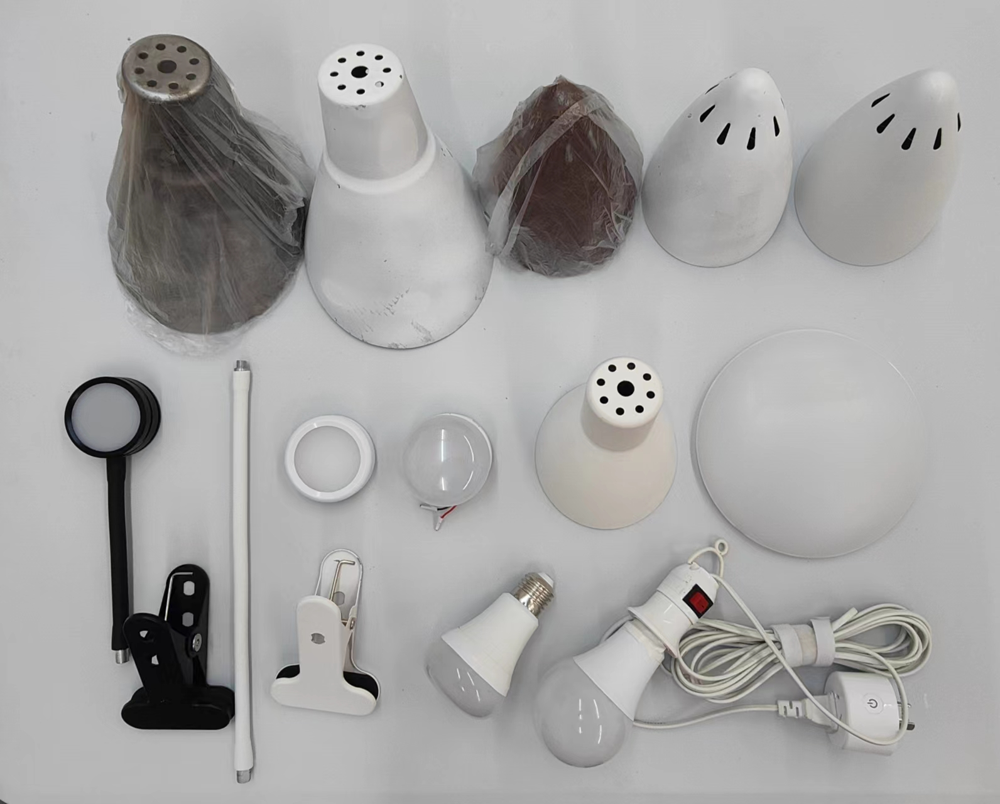
</p>

Different mechanical components were compared for fit, appearance, assembly, sourcing, and cost.

### First Full Assembly

<p align="center">
  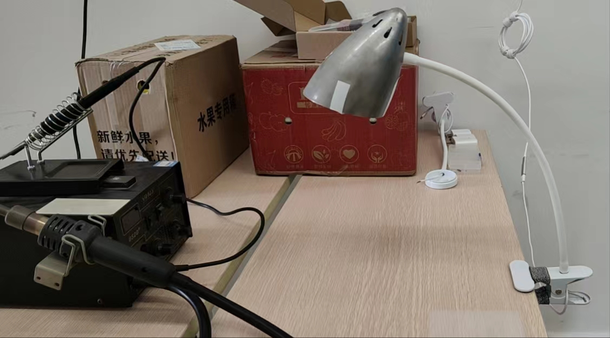
</p>

*First full assembly prototype before painting and final surface finishing.*

This stage brought the PCB, lamp head, flexible arm, clamp, wiring, enclosure, and power system together as a complete physical product.

---

## Key Engineering Challenges

### 1. Audible Board Noise

After extended operation at high brightness, some PCB assemblies developed noticeable audible noise.

The debugging process included:

- reproducing the issue across multiple boards;
- replacing and testing individual components;
- changing capacitor selections;
- modifying component and LED placement;
- improving thermal distribution in later revisions.

These changes substantially reduced the issue.

Because no dedicated acoustic or component-vibration measurements were performed at the time, I treat the exact physical root cause as **not fully instrumentally verified**.

### 2. Thermal Distribution

The compact lamp head provided limited passive cooling.

During development, temperature behavior was monitored while LED and component arrangements were changed. Later revisions distributed the LEDs more evenly and adjusted supporting-component placement to reduce localized thermal concentration.

### 3. Bluetooth RF Attenuation

An early enclosure concept used a largely closed metal housing.

Bluetooth range became noticeably worse once the electronics were installed inside the enclosure. Testing with several phones showed that the mechanical structure was affecting wireless performance.

The enclosure approach was revised to reduce shielding around the Bluetooth module.

This became an early lesson that a circuit working correctly on the bench may behave differently once installed inside the final mechanical structure.

### 4. Assembly & Serviceability

An early enclosure assembly relied heavily on structural adhesive.

Although it worked mechanically, it made the product difficult to reopen for repair.

Later assembly approaches incorporated threaded mechanical interfaces to improve disassembly and serviceability.

---

## Bluetooth & App Control

The wireless-control layer used the Tuya Bluetooth platform.

<p align="center">
  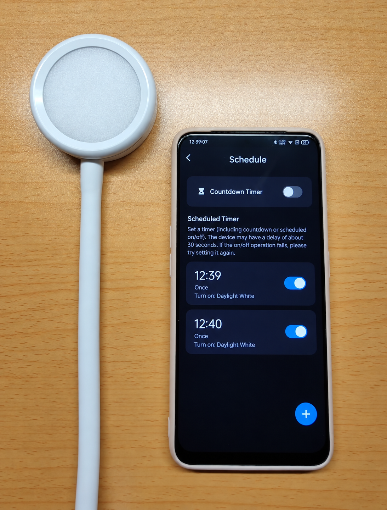
</p>

*The original app interface was in Chinese; UI text in this image was translated to English for portfolio readability.*
The mobile application provided scheduled operation and remote lighting control.

<p align="center">
  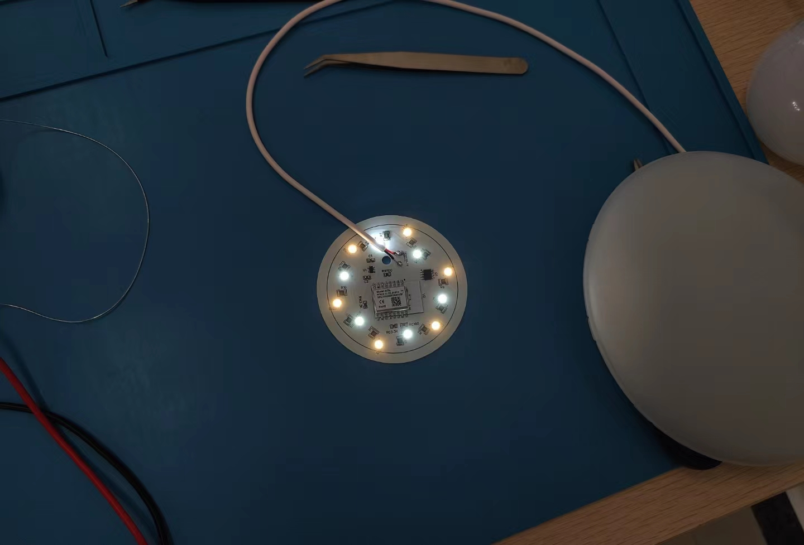
</p>

### Video Demo

[▶ Watch the app-control demo](demo/app-control-demo.mp4)

The demo shows the mobile application controlling the physical lamp.

---

## Testing & Results

### Prototype Testing

<p align="center">
  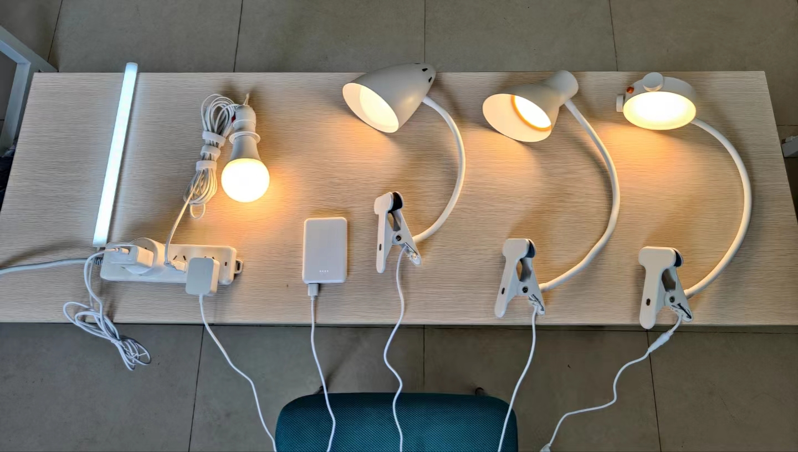
</p>

Prototype testing included functional checks, lighting behavior, Bluetooth connectivity, thermal observation, and extended operation.

### Lifetime Testing

<p align="center">
  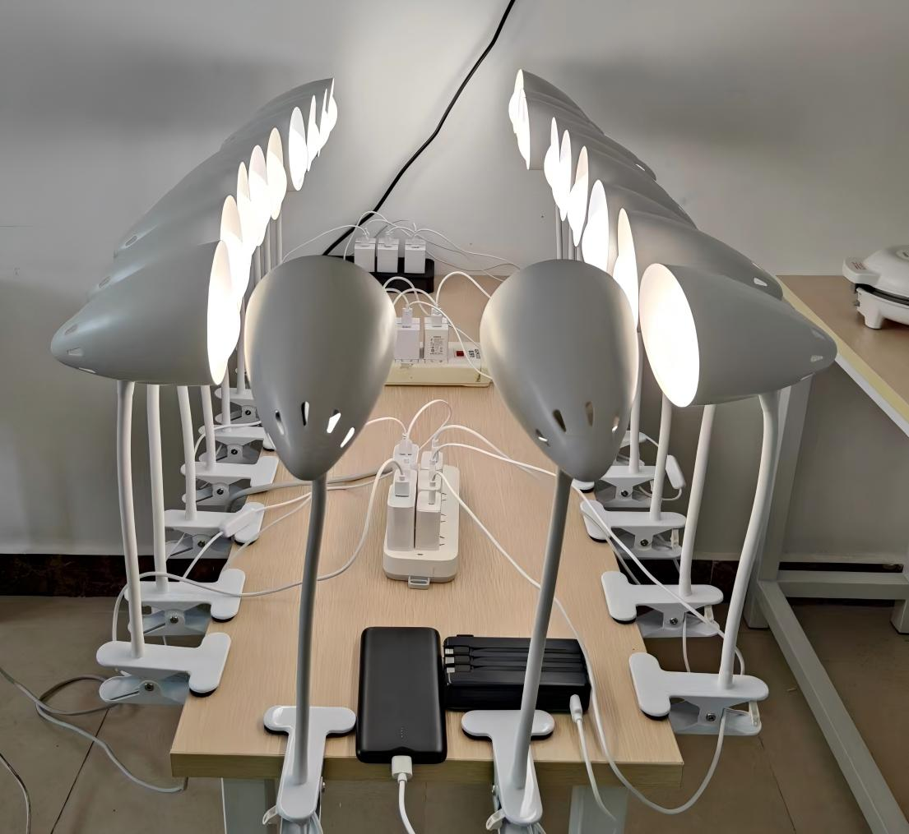
</p>

Multiple assembled units were operated simultaneously in a **24/7 continuous lifetime-test setup**.

### Final Results

- **30+ physical units** assembled and tested
- Multi-unit **24/7 continuous lifetime testing**
- Experience spanning PCB iteration, SMT rework, sourcing, cost tracking, and small-batch assembly
- **Silver Award — Jinan University Challenge Cup**

This project taught me that getting a circuit to work on a bench is only the beginning.

A usable hardware product must also account for **thermal behavior, RF performance, mechanical integration, assembly, serviceability, sourcing, repeatability, and cost.**
---


## Repository Scope

This repository is intended as an **engineering portfolio and technical case study**, not as an open-source hardware release.

The following materials are intentionally not published:

- original PCB source files;
- Gerber and manufacturing packages;
- complete production BOMs;
- supplier and pricing records;
- Tuya firmware or proprietary application files;
- project materials that I do not have sole authority to release.

The materials published here are intended to demonstrate the engineering process, hardware iteration, debugging work, testing, and physical product implementation.

---

## Acknowledgments

This was a collaborative project developed at **Jinan University**.

I am grateful to my original project collaborator and to the students who later contributed to prototype development, testing, and additional product exploration.
